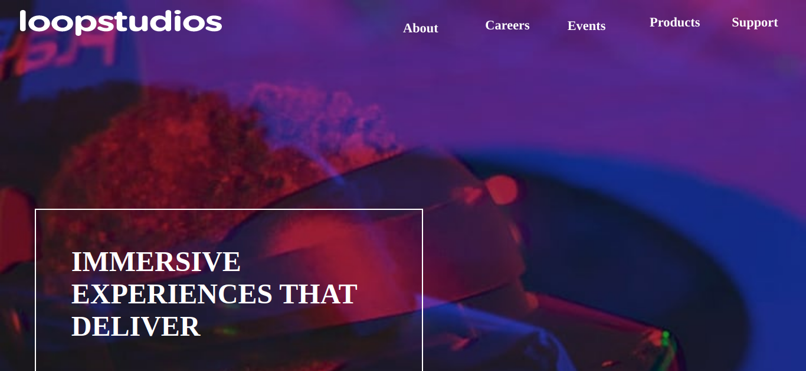
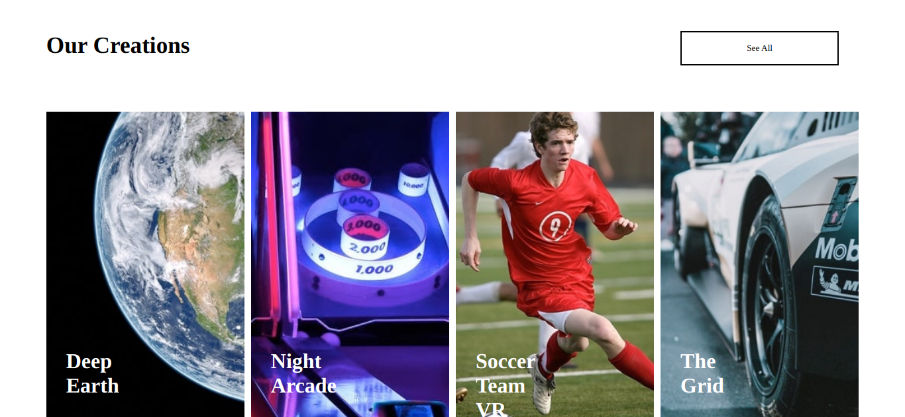

# Frontend Mentor - Loopstudios landing page solution

This is a solution to the [Loopstudios landing page challenge on Frontend Mentor](https://www.frontendmentor.io/challenges/loopstudios-landing-page-N88J5Onjw). Frontend Mentor challenges help you improve your coding skills by building realistic projects. 

## Table of contents

- [Frontend Mentor - Loopstudios landing page solution](#frontend-mentor---loopstudios-landing-page-solution)
  - [Table of contents](#table-of-contents)
  - [Overview](#overview)
    - [The challenge](#the-challenge)
    - [Screenshot](#screenshot)
    - [Links](#links)
  - [My process](#my-process)
    - [Built with](#built-with)
  - [Author](#author)

## Overview

### The challenge

Users should be able to:

- View the optimal layout for the site depending on their device's screen size
- See hover states for all interactive elements on the page

### Screenshot

### Links

- Solution URL: [github repository](https://github.com/WalterSiqueira/loopstodios_landing_page)
- Live Site URL: [vercel](https://loopstodios-landing-page.vercel.app)

## My process

### Built with

- Semantic HTML5 markup
- CSS custom properties
- Flexbox
- CSS Grid
- Mobile-first workflow
- sass/scss
- [React](https://reactjs.org/) - JS library
- [Next.js](https://nextjs.org/) - React framework
 
 ## Author

- Website - [Walter](https://portifolio-page-walter.vercel.app/)
- Frontend Mentor - [@WalterSiqueira](https://www.frontendmentor.io/profile/WalterSiqueira)
- Twitter - [@Walter__BS](https://www.twitter.com/Walter__BS)
